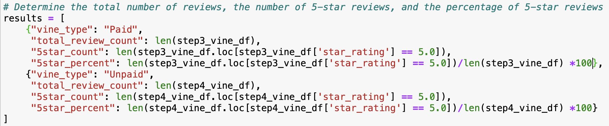
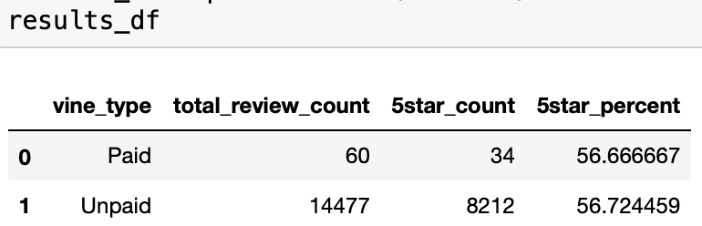
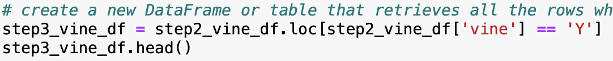
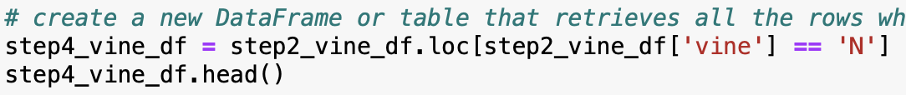

# Amazon_Vine_Analysis

## Overview

The purpose of this analysis is to determine if having a paid Vine review makes a difference in the percentage of 5-star reviews. For this analysis, we are using the Musical Instrument review file which can be downloaded with the following link:

NOTE: opening the link will automatically download the zip file.

[Amazon Musical Instrument Reviews](https://s3.amazonaws.com/amazon-reviews-pds/tsv/amazon_reviews_us_Musical_Instruments_v1_00.tsv.gz)

## Results

Below you will see the `results` list where we calculate the necessary metrics and the `results_df` dataframe where we display the results.

### - How many Vine reviews and non-Vine reviews were there?

To calculate the number of Vine reviews, we name the dataframe `step3_vine_df` and filter the dataframe using the `loc[]` function. We filter where `step2_vine_df['vine'] == 'Y'` using the filtered vine dataframe. We then use the `len()` function to count the number of rows in the dataframe. As a result, we get 60 vine reviews.

To calculate the number of non-Vine reviews, we name the dataframe `step4_vine_df` and filter the dataframe using the `loc[]` function. We filter where `step2_vine_df['vine'] == 'N'` using the filtered vine dataframe. We then use the `len()` function to count the number of rows in the dataframe. As a result, we get 14,477 vine reviews.

### - How many Vine reviews were 5 stars? How many non-Vine reviews were 5 stars?

To calculate the number of Vine 5-star reviews, we filtered the vine dataframe using the `loc[]` function where `step3_vine_df['star_rating'] == 5.0`. We then use the `len()` function to count the number of rows in the `loc[]` function. As a result, we get 34 vine 5-star reviews.

To calculate the number of non-Vine 5-star reviews, we filtered the non-vine dataframe using the `loc[]` function where `step4_vine_df['star_rating'] == 5.0`. We then use the `len()` function to count the number of rows in the `loc[]` function. As a result, we get 8,212 non-vine 5-star reviews.

### - What percentage of Vine reviews were 5 stars? What percentage of non-Vine reviews were 5 stars?

To calculate the Vine 5-star reviews percentage, we take our 5-star review count from the previous bulletin and divide it by the total number of reviews, which we calculated on the first bulletin of the review. We then multiply by 100 to get the percentage. Our percentage is 56.666667%.

To calculate the number of non-Vine 5-star reviews, we take our 5-star review count from the previous bulletin and divide it by the total number of reviews, which we calculated on the first bulletin of the results. We then multiply by 100 to get the percentage. Our percentage is 56.724459%.

## Summary

After further analysis, we see that there is no bias towards reviews that were written as part of the Vine program. If there was a bias for the paid reviews, then the 5-star percentage would be greater than the non-paid percentage, but instead it is roughly same as the non-paid percentage.

An additional resource that would help our claim is using the verified purchase column to our analysis. If we filter the dataframe to only show verified purchase reviews and compare the percentage to total reviews, it will give us a better idea if there is bias in the vine program.